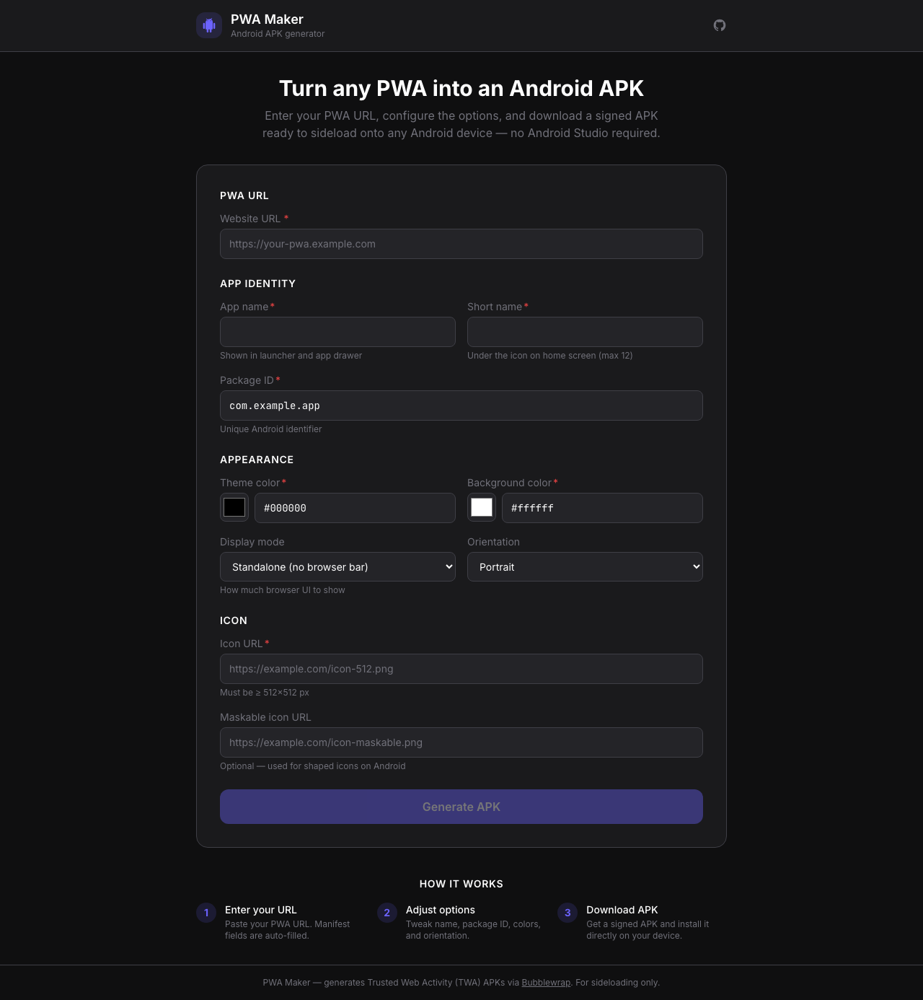
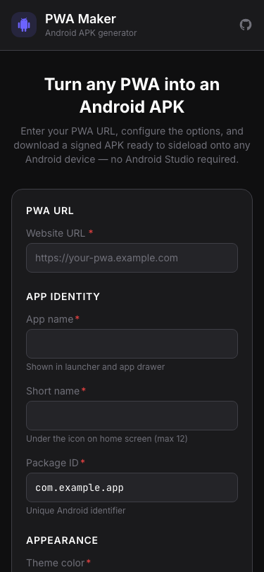

> [!CAUTION]
> This entire project was built by Claude Code (Sonnet 4.6). Started from an empty folder and a single prompt and some clarifications to a working app with the only human-written content in this opening paragraph. I asked it to respect, and give credit to anyone's code ripped off the web, but this here app is a mere 'state of agnentic-code' experiment, and functionality I needed myself. I am NOT a dev (by profession), Claude is book-smart but **cannot think**. Keep that in mind firing up any of the below.
>
> [Journey log here](stats.md)

# PWA Maker — Android APK Generator

> Turn any Progressive Web App into a signed Android APK you can sideload directly onto any Android device. No Android Studio, no Play Store, no fuss.



---

## What it is

A self-hosted web application that wraps any HTTPS PWA in a [Trusted Web Activity (TWA)](https://developer.chrome.com/docs/android/trusted-web-activity/) shell and produces a signed `.apk` file — ready to install directly on any Android phone.

Built with the same stack as a typical vibecoded PWA (React + Vite frontend, Express backend), so it runs consistently on both your MacBook and VPS.

---

## Screenshots

### Desktop


### Mobile



---

## Features

- Paste any HTTPS PWA URL → manifest fields auto-filled
- Configurable: app name, short name, package ID, theme/background colour, display mode, orientation, icon
- Server-side APK build via [Bubblewrap](https://github.com/GoogleChromeLabs/bubblewrap) + Android SDK 34
- Live build log streamed via SSE while you wait
- Download a signed APK directly in browser
- Dark theme, mobile-first UI
- Rate limiting, input validation, non-root container, no shell injection
- Docker Compose — one command deploy

---

## Prerequisites

- Docker + Docker Compose on your VPS
- An SSL-terminating reverse proxy in front of the stack (Nginx Proxy Manager, Caddy, Traefik, etc.)
- That's it

---

## Quick start

### 1. Clone

```bash
git clone https://github.com/niels-emmer/pwa-maker-android.git
cd pwa-maker-android
```

### 2. Configure

```bash
cp .env.example .env
# Edit .env if you want to change rate limits or TTL
# All defaults are sane for a personal VPS
```

### 3. Build and start

```bash
docker-compose up -d --build
```

> **First build takes 15–30 minutes** — the backend image installs JDK 17 + Android SDK (~1.5 GB). Subsequent builds use Docker layer cache and are fast.

### 4. Point your reverse proxy at the app port

The frontend container binds to `HOST_PORT` on the host (default **8080**).
If port 80 is free you can set `HOST_PORT=80` in `.env`; otherwise leave the default
and point your reverse proxy at the container:

```
# .env
HOST_PORT=8080        # change to 80 if nothing else is on port 80
```

Example Nginx Proxy Manager / Caddy upstream target: `http://<vps-ip>:8080`

### 5. Open the app

Navigate to your domain. Paste a PWA URL, configure options, click **Generate APK**.

---

## Usage

1. **Enter your PWA URL** — e.g. `https://my-app.example.com`
   - The manifest is fetched automatically and all fields are pre-filled
2. **Adjust options** — name, package ID, colours, orientation
3. **Click Generate APK** — watch the build log stream in real time (first build ~2–5 min while Gradle downloads dependencies; cached builds ~30s)
4. **Download** — click the Download APK button when the build completes
5. **Install** — transfer the `.apk` to your Android device and open it (enable "Install from unknown sources" in Settings → Security)

---

## Configuration

All configuration is via environment variables in `.env`:

| Variable | Default | Description |
|---|---|---|
| `HOST_PORT` | `8080` | Host port the frontend is exposed on |
| `NODE_ENV` | `production` | Node environment |
| `PORT` | `3001` | Backend listen port (internal) |
| `ANDROID_HOME` | `/opt/android-sdk` | Android SDK path (set in Docker) |
| `JAVA_HOME` | `/usr/lib/jvm/java-17-openjdk-amd64` | JDK path (set in Docker) |
| `GRADLE_USER_HOME` | `/home/appuser/.gradle` | Gradle cache (mounted as volume) |
| `MAX_CONCURRENT_BUILDS` | `3` | Max simultaneous APK builds |
| `BUILD_RATE_LIMIT_PER_HOUR` | `10` | Max builds per IP per hour |
| `BUILD_TTL_HOURS` | `1` | Hours to keep built APK available |
| `CORS_ORIGIN` | `*` | Allowed CORS origin |

---

## Docker internals

```
pwa-maker-android/
├── frontend/          React + Vite SPA → served by Nginx
│   └── nginx.conf     Nginx config: serves SPA + proxies /api/* to backend
├── backend/           Express + TypeScript + Android build toolchain
│   └── Dockerfile     Node 20 + JDK 17 + Android SDK 34 (~1.5 GB image)
└── docker-compose.yml
```

The `gradle_cache` named volume persists between container restarts so Gradle dependencies (~200 MB) are only downloaded once.

To clear the Gradle cache:
```bash
docker-compose down -v
```

---

## Development

### Backend

```bash
cd backend
npm install
npm run dev        # tsx watch — hot reload
npm test           # vitest — 46 tests
```

### Frontend

```bash
cd frontend
npm install
npm run dev        # Vite dev server on :5200
npm test           # vitest + React Testing Library — 37 tests
```

The frontend dev server proxies `/api/*` to `localhost:3001`.

---

## Authentication

This app has **no built-in auth**. Protect it at the reverse proxy level. See [SECURITY.md](SECURITY.md) for options and recommendations.

---

## Sideloading on Android

1. Enable **Install unknown apps** for your file manager / browser:
   - Settings → Apps → Special app access → Install unknown apps
2. Transfer the `.apk` to your device (USB, email, cloud storage, local network)
3. Tap the file to install

The installed app will appear on your home screen / app drawer like any other app.

> Each build generates a fresh signing key. If you reinstall a newer build of the same app, you must first uninstall the old version (Android enforces consistent signing for upgrades). This is acceptable for personal sideloaded use.

---

## Security

See [SECURITY.md](SECURITY.md) for the full security design, reporting policy, and hardening notes.

---

## Tech stack

| Layer | Technology |
|---|---|
| Frontend | React 18, Vite, TypeScript, Tailwind CSS |
| Backend | Node 20, Express, TypeScript |
| APK generation | [@bubblewrap/core](https://github.com/GoogleChromeLabs/bubblewrap), Android SDK 34, JDK 17 |
| Build tooling | Gradle (Android) |
| Signing | `apksigner` (Android build tools) |
| Progress delivery | Server-Sent Events (SSE) |
| Tests | Vitest, React Testing Library |
| Container | Docker, Nginx |

---

## License

MIT
